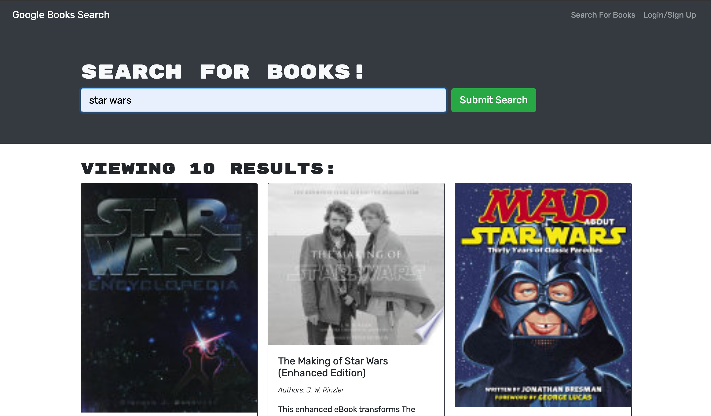

# Book Search Engine MERN

## Table of Contents
- [Book Search Engine MERN](#book-search-engine-mern)
  - [Table of Contents](#table-of-contents)
  - [Description](#description)
  - [User Story](#user-story)
  - [Installation](#installation)
  - [Usage](#usage)
  - [Credits](#credits)
  - [License](#license)
  - [Contribution](#contribution)
  - [Tests](#tests)
  - [Questions](#questions)

## Description

The task was a challenge assigned to us where we had to take starter code for a fully functioning Google Books API search engine built with a RESTful API, and refactor it to be a GraphQL API built with Apollo Server. The app was built using the MERN stack with a React front end, MongoDB database, and Node js/Express js server and API. It was already set up to allow users to save book searches to the back end.

This was a bit challenging for me to get working correctly even thought I thought I had parts correct. I was unable to get the login and sign up to work correctly using GraphQL API and Apollo but I hope to come back to this and complete it.


## User Story

```
AS AN avid reader
I WANT to search for new books to read
SO THAT I can keep a list of books to purchase
```

## Installation
N/A
## Usage

[Link to deployed application.]() <br>
[Repository](https://github.com/crzn24/book-search-engine-mern.git) <br>



## Credits
<!-- * [](https://) -->

## License


## Contribution 


## Tests 
N/A

## Questions
Github: crzn24